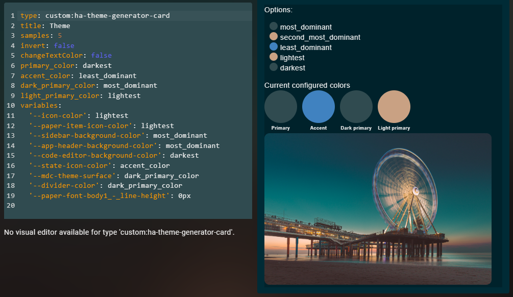

# ha-theme-generator-card
Home Assistant Theme Generator Card

## Installation
Create a file **ha-theme-generator-card.js** in the folder **/homeassistant/www** and copy/pase [this code](https://github.com/tomroeleveld/ha-theme-generator-card/blob/main/ha-theme-generator-card.js) in the file.
In HA, go to the **resources** page (/config/lovelace/resources), click on the **Add resource** button and specify the JS file (/local/ha-theme-generator-card.js).
## Add card to dashboard
Add a custom card and specify the following config:

```
type: custom:ha-theme-generator-card
title: Theme
samples: 5
invert: false
changeTextColor: false
primary_color: darkest
accent_color: least_dominant
dark_primary_color: most_dominant
light_primary_color: lightest
```

## Configuration properties


There are some properties that can be configured:

**samples [int]**

This will specify the amount of samples to take from the background image

**invert [true/false]**

This will invert the dark with the light colors

**changeTextColor [true/false]**

Speicify if text color should be changed

## Specify colors
The theme generator card will show the available colors from the background image under **colors**.
The following colors will be available:
* most_dominant
* second_most_dominant
* least_dominant
* lightest
* darkest

This can be mapped to the Home Assistant Theme as stated below:

```
primary_color: darkest
accent_color: least_dominant
dark_primary_color: most_dominant
light_primary_color: lightest
```

So Home Assistants primary color will be mapped to the darkest color from the theme card. The accent color will be mapped to the least_dominant color, etc

It's also possible to overwrite HA's stylesheet variables. This is shown in the code below:

## Full config example

```
type: custom:ha-theme-generator-card
title: Theme
samples: 5
invert: false
changeTextColor: false
primary_color: darkest
accent_color: least_dominant
dark_primary_color: most_dominant
light_primary_color: lightest
variables:
  '--icon-color': lightest
  '--paper-item-icon-color': lightest
  '--sidebar-background-color': most_dominant
  '--app-header-background-color': most_dominant
  '--code-editor-background-color': darkest
  '--state-icon-color': accent_color
  '--mdc-theme-surface': dark_primary_color
  '--divider-color': dark_primary_color
  '--paper-font-body1_-_line-height': 0px

```
